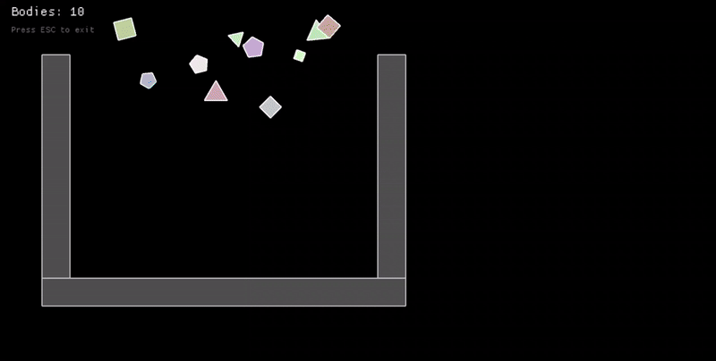

# physics engine

A 2D physics engine written in Rust. It currently supports collision detection, collision resolution, and basic physics (velocity, gravity, restitution). I tried to make it have an api design similar to box2d for the RigidBody and PhysicsWorld.

Originally prototyped in Python (`/python`), now being rewritten in Rust for performance and as a learning exercise.



## What works right now

- **AABB overlap** — fast bounding box pre-check to skip expensive math
- **SAT** — separating axis theorem for convex polygon collision
- **MTV** — minimum translation vector, tells you how far to push shapes apart
- **Point-in-polygon** — ray casting to test if a point is inside a shape
- **Concave collision** — vertex containment + edge intersection for non-convex shapes
- **RigidBody Dynamics** — world-based simulation with static and dynamic bodies

## Try it

```
git clone https://github.com/adyanthm/physics.git
cd physics
cargo run
```

`cargo run` opens an interactive sandbox where you can try out the falling box and platformer demos.

```
cargo test
```

Runs the test suite — covers every public function.

## Roadmap

See [roadmap.md](roadmap.md) for the full plan. Short version:

- [x] Collision resolution (push objects apart using MTV)
- [x] Velocity, gravity, basic integration
- [x] Basic RigidBody & PhysicsWorld architecture
- [ ] Continuous collision detection (prevent tunneling)
- [ ] Contact points and impulse resolution
- [ ] Spatial partitioning (quadtree / grid)
- [ ] Proper `Vec2` struct with operator overloading
- [ ] Rotation and angular velocity

## License

MIT — see [LICENSE.md](LICENSE.md).
